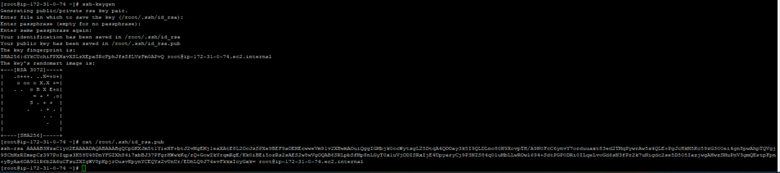
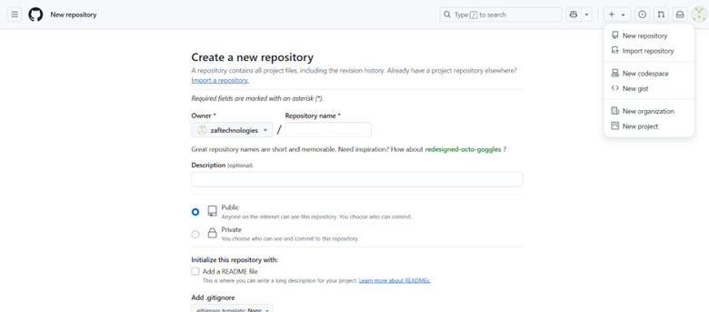
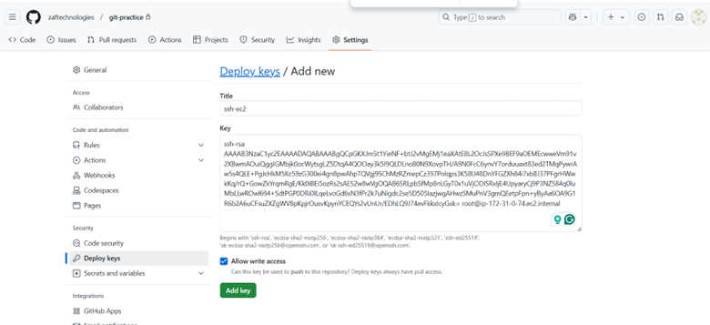

# Git Lab

Document Version 1.0 
Date: 2024-12-21
Author:  [Talha Jilal] [ https://github.com/zaftechnologies ]
Copyright: 2024 Zaf Technologies Inc
Revision: 1.0

Copyright © 2024 Zaf Technologies Inc. All Rights Reserved.

<!-- ## Table of Contents
- [Pre-Req Create AWS Free Tier Linux VM ](4.Lab_1.md#Free_Free_tier_Linux_VM)
  - [Table of Contents](#table-of-contents)
  - [Intro](#intro)
  - [Install Git Client](#Install-Git)
  - [SSH Key](#Generate-SSH-Key)
  - [Sign Up on GitHub](#SignUP)
  - [Git commands](#Git-Commands) -->
 

 ## Table of Contents
- [Pre-Req](#Pre-Req)
- [Intro](#intro)
- [Install Git Client](#install-git-client)
  - [Windows](#windows)
  - [Linux](#linux)
  - [macOS](#macos)
  - [Install Git on EC2 Linux Instance](#install-git-on-ec2-linux-instance)
- [SSH Key](#ssh-key)
- [Sign Up on GitHub](#sign-up-on-github)
- [Create Your First Git Repository](#Create-Your-First-Repo)
- [Deploy SSH Key](#SSH-Key-Setup)
- [Git Practice Commands](#git-practice-commands)


## Pre-Req
 - [Pre-Req Create AWS Free Tier Linux VM ](4.Lab_1.md#Free_Free_tier_Linux_VM)

## Intro

    What 
    Git is a distributed version control system (VCS).
    It helps track changes in source code during software development.
    Enables collaboration by allowing multiple developers to work on the same codebase.

    Why 
    Keep a history of changes.
    Collaborate seamlessly with others.
    Revert to previous versions if needed.
    Branch and experiment without affecting the main codebase.

## Install git client

### Windows

Windows: Download from git-scm.com.

### Linux 

Linux: Run sudo apt install git (Ubuntu) or sudo yum install git (CentOS).

### macOS

macOS: Install via Homebrew: brew install git.

### Linux Example 

Login Ec2 Linux Instance and install git

```
yum -y install git
git --version
```

## SSH Key

GitHub asks for SSH key authentication to ensure secure, password-less, and identity-verified access to your repositories. This process eliminates the need to enter your GitHub username and password every time you interact with your repositories, which improves both security and usability.

Let's create simple ssh-key on our Test Linux Machine  


```
ssh-keygen 
```

## Sign Up on GitHub 

Anyone can create free github account and host private and public git repos. 

- Public Git repos : Anyone can read your repositories, but only owner or contributer can write
- Private : Only a person who have access can read /write and with proper permissions.


## Create Your First Git Repository

Create a New Repository

- Click the + icon in the top-right corner.
- Select New repository.
- Fill in Repository Details

- Repository Name: Choose a unique name for your repository.
- Description (optional): Add a brief description.
- Visibility: Choose between Public or Private.
- Check the box for "Add a README file" if you want an initial README file.





## Deploy SSH Key 

Deploy SSH key for your newly created git repository

- Click on Repositories Settings 
- Click on left side "Deploy Keys" 
- Copy public key content from Linux VM and Paste

```
cat root/.ssh/id_rsa.pub  
```




## Git Commands 

- Setup your profile ( Only for Linux Console or command linux, GUI clients set this information automatically.)

``` 
git config --global user.name "Talha Jilal"
git config --global user.email "talhajilal@gmail.com”
```

- Clone an existing GitHub repository to your local system:

```
git clone https://github.com/yourusername/my-project.git
cd my-project
```

- Create a new branch:

```
git branch feature-branch

```

- Create a new branch:

```
git checkout -b feature-branch
```

- Add content into your new git repository.

```
vi newfile
```
Save file 

```
git add .
git commit -m "Some Meaningful comments"
```

- First time branch push to git 

```
git push --set-upstream origin feature-branch
```

- Check git logs

```
git log
```

- Remove file from git remote origin

``` 
git rm file_name
git add .
git commit -m "Removing file"
git push origin
```
