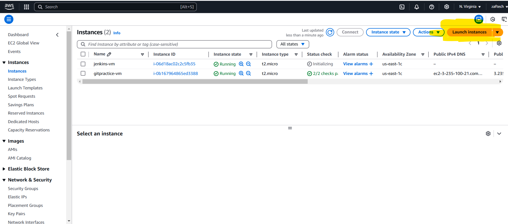
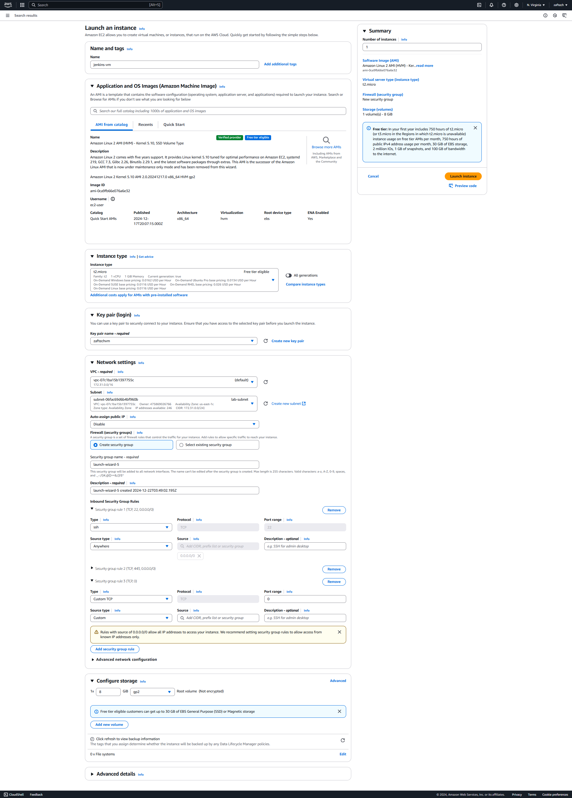
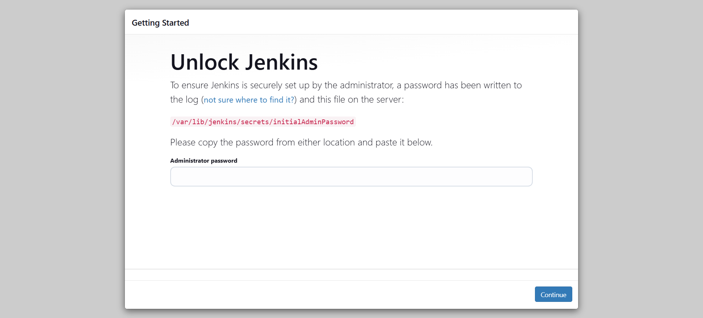
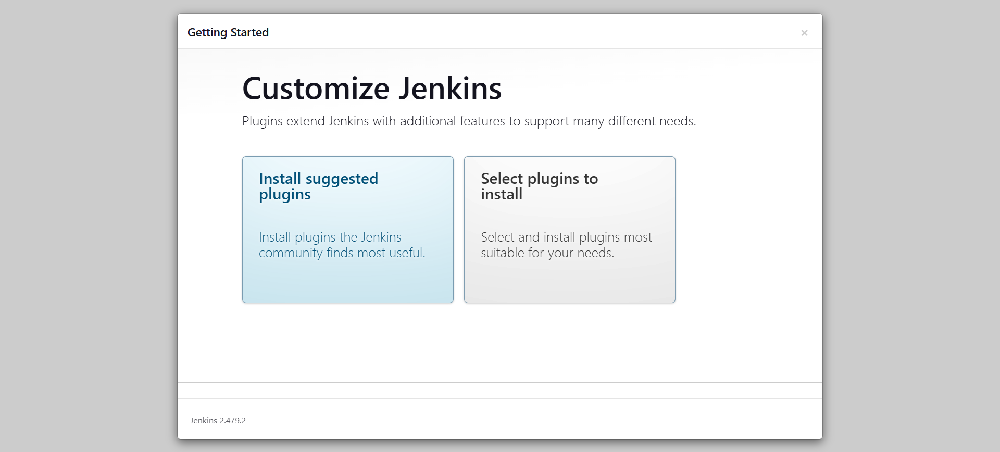
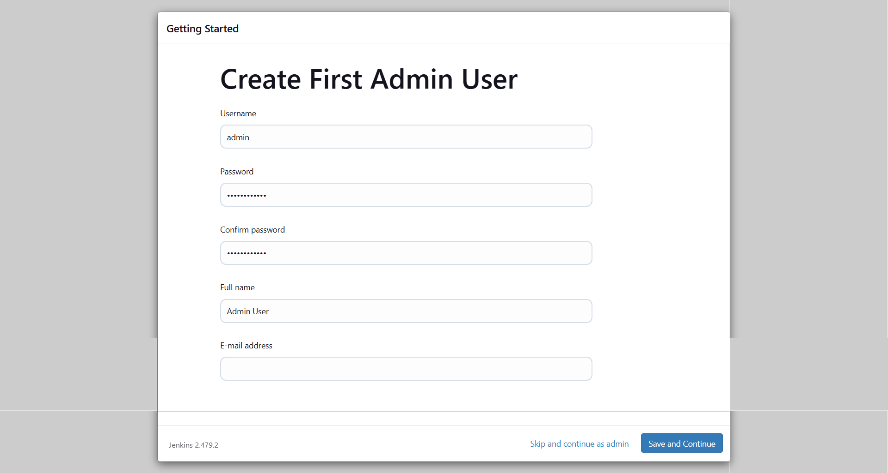

Document Version 1.0 
Date: 2021-06-01
Author:  [Talha Jilal] [ https://github.com/zaftechnologies ]
Copyright: 2024 Zaf Technologies Inc
Revision: 1.0

Copyright © 2024 Zaf Technologies Inc. All Rights Reserved.

 ## Table of Contents
- [Prerequisites](#pre-req)
- [Intro](#intro)
  - [Introduction](#introduction)
  - [Key Features of Jenkins](#key-features-of-jenkins)
  - [Why Use Jenkins?](#why-use-jenkins)
  - [Create AWS Ec2 Linux VM For Jenkins](#create-aws-ec2-linux-vm-for-jenkins)
  - [Jenkins Lab: Basic Pipeline](#jenkins-lab-basic-pipeline)

## Prerequisites

[Create AWS Free Tier Linux VM](4.Lab_1.md#Free_Free_tier_Linux_VM)

[Git Basics](12_Git_lab.md#Git_basic_commands)

## Introduction

Jenkins is an open-source automation server widely used for Continuous Integration (CI) and Continuous Delivery (CD). It helps automate the parts of software development related to building, testing, and deploying, making it a vital tool for DevOps practices.

### Key Features of Jenkins

- Open Source: Free to use and customizable.
- Extensible: Thousands of plugins to integrate with various tools and technologies.
- Cross-Platform: Runs on Windows, macOS, and Linux.
- Web Interface: Easy-to-use, browser-based interface.
- Distributed Builds: Can distribute workloads across multiple machines.

### Why Use Jenkins?

- Automates repetitive tasks, like builds and tests.
- Detects and fixes bugs early through continuous integration.
- Facilitates faster delivery of software with continuous deployment.
- Integrates seamlessly with version control systems like Git and tools like Ansible, Docker, and Kubernetes.

### Create AWS Ec2 Linux VM For Jenkins

-  Go to the AWS Management Console and navigate to the EC2 Dashboard "https://console.aws.amazon.com/console/home?nc2=h_ct&src=header-signin" 
- Launch AWS Ec2 instance from EC2 

- Choose "Amazon Linux 2 AMI (HVM), SSD Volume Type."

    a- Select the instance type (t2.micro for free tier).

    b- Configure the instance details.

    c- Configure the security group to allow TCP rule for Jenkins (port 8080).



### Jenkins Lab: Basic Pipeline

1- Prerequisites 
   - Environment: AWS EC2 instance with Ubuntu or Amazon Linux 2.
   - Access: SSH access to the instance.
   - Software: Java, Jenkins, Git.

Step 1: Install Jenkins

- Update system and install jenkins with yum command on Amazon Linux VM. 

```
sudo yum update -y  # For Amazon Linux
```

- Install Java ( Jenkins prerequisite)

```
amazon-linux-extras enable epel
yum clean metadata
# or  for Amazon latest Linux EC2.
yum install java
```

- Add Jenkins Repository ( Provide some introduction about yum package manager if Majority of audience ask )


```
sudo wget -O /etc/yum.repos.d/jenkins.repo https://pkg.jenkins.io/redhat-stable/jenkins.repo
#disable gpgcheck. 
sed -i 's/gpgcheck=1/gpgcheck=0/g'  /etc/yum.repos.d/jenkins.repo
```

- Install Jenkins 

```
yum install jenkins -y
```

- Start Jenkins and enable jenkins to start when system reboot.

```
sudo systemctl start jenkins
sudo systemctl enable jenkins
```

- Get Jenkin admin password 

```
cat /var/lib/jenkins/secrets/initialAdminPassword
```

- Login to Web Console, 

http://Ip_address:8080



- Select "Install Suggested Plugins"



- Wait for Jenkins to compelete initial setup.


- On Next screen Create your own admin user

