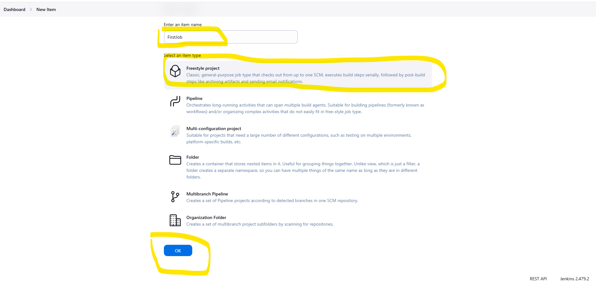
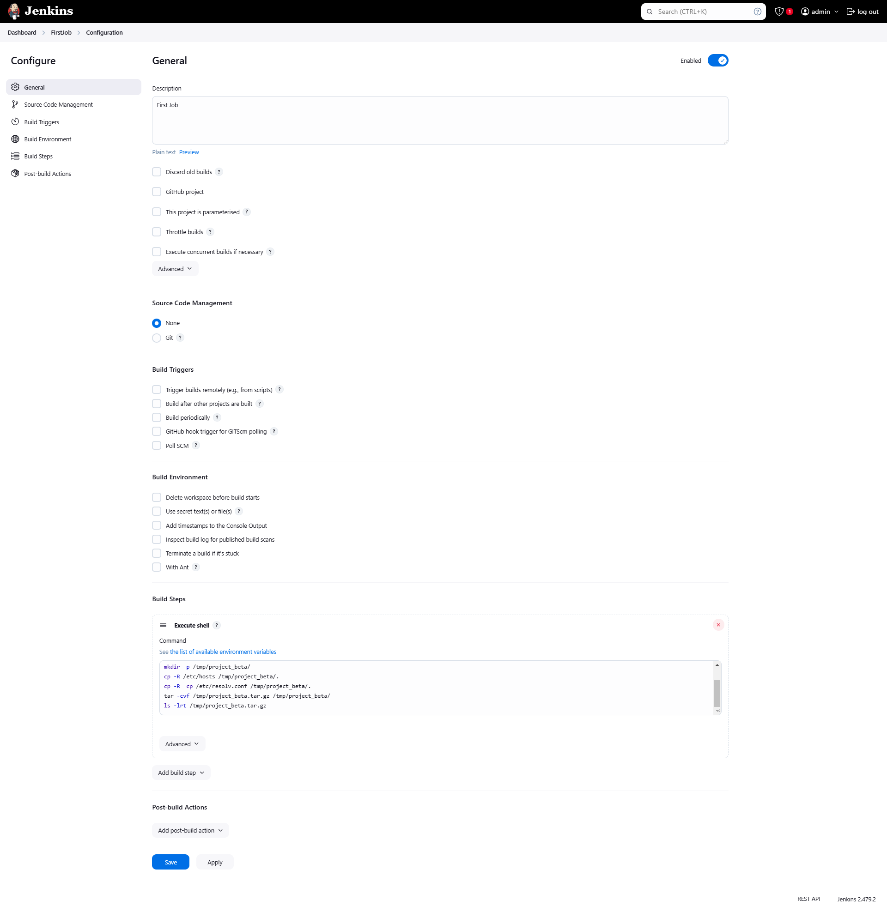
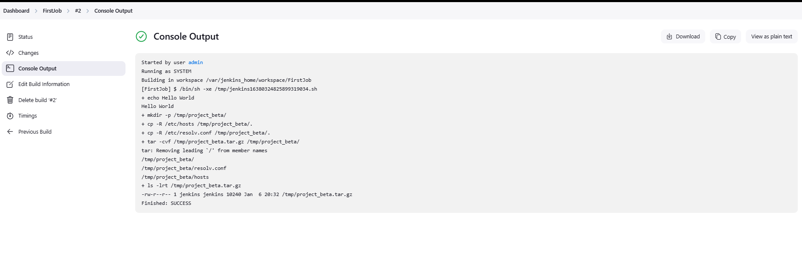
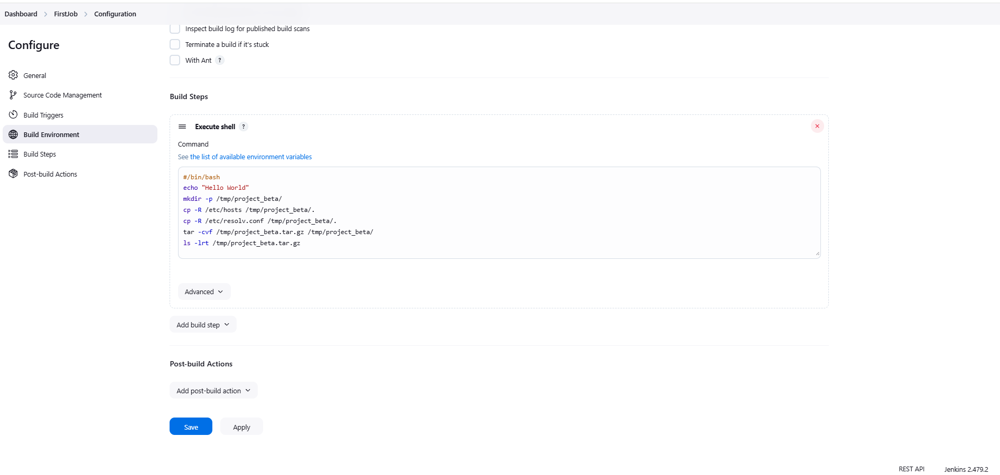

# Step-by-Step Instructions to Create a Jenkins FreeStyle Job


Document Version 1.0 
Date: 2025-01-06
Author:  [Talha Jilal] [ https://github.com/zaftechnologies ]
Copyright: 2025 Zaf Technologies Inc
Revision: 1.0

Copyright © 2025 Zaf Technologies Inc. All Rights Reserved.

 ## Table of Contents
- [Prerequisites](#pre-req)
- [Intro](#intro)
  - [Introduction](#introduction)
  - [Create AWS Free Style Job](#create_free_style_job)
    - [General Section](#general-section)
    - [Build Section](#build-section)
  - [Why Use Jenkins?](#why-use-jenkins)


## Prerequisites

[Create AWS Free Tier Linux VM](4.Lab_1.md#Free_Free_tier_Linux_VM)

[Git Basics](12_Git_lab.md#Git_basic_commands)

[Jenkins_lab1](14_Jenkins_Lab.md#Jenkins_lab)

## Introduction

Step-by-Step Instructions to Create a Jenkins FreeStyle Job.

### Create AWS Free Style Job

#### Access Jenkins


1. Open your web browser and navigate to your Jenkins instance:

2. Log in using your Jenkins credentials.

3. On the Jenkins dashboard, click on the **"New Item"** link in the left-hand menu.

4. In the "Enter an item name" field, type a name for your job (e.g., `MyFirstJob`).

5. Select **"FreeStyle project"** from the list of options.

6. Click the **OK** button.




### General Section


1. **Project Name**: Verify the name of your job.
2. (Optional) Add a **Description** to explain the purpose of the job (e.g., "This job prints 'Hello, World!' in the console.").

" Source Code Management (Optional) " We will learn about this later.

1. If your job involves code from a repository:
- Select your version control system (e.g., Git).
- Add your repository URL and credentials (if needed).
2. Skip this step for basic jobs that don’t involve code repositories.

### Build Section



1. In the "Build" section, click **"Add build step"**.
2. Select **"Execute shell"** (for Linux/Unix) or **"Execute Windows batch command"** (for Windows).
3. Enter a simple script or command:
- **Linux/Unix**:
 
```
#/bin/bash
echo "Hello World" 
mkdir -p /tmp/project_beta/
cp -R /etc/hosts /tmp/project_beta/.
cp -R /etc/resolv.conf /tmp/project_beta/.
tar -cvf /tmp/project_beta.tar.gz /tmp/project_beta/
ls -lrt /tmp/project_beta.tar.gz
```




Note : 

In this example we are setting up example for artifact. 


### Trigger Build

1. On the job page, click the **"Build Now"** link in the left-hand menu.
2. A new build will appear under the "Build History" section.





