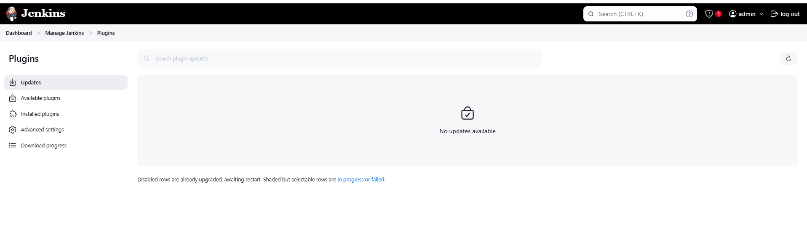

# Jenkins Plugins

Document Version 1.0 
Date: 2025-01-06
Author:  [Talha Jilal] [ https://github.com/zaftechnologies ]
Copyright: 2025 Zaf Technologies Inc
Revision: 1.0

Copyright © 2025 Zaf Technologies Inc. All Rights Reserved.


 ## Table of Contents
- [Intro](#intro)
- [Objective](#Objective)
    - [Enhance Jenkins’ Capabilities](#enhance-jenkins-capabilities)
    - [Ease Automation](#ease-automation)
    - [Real-World Relevance](#real-world-relevance)
    - [Commonly used plugins](#commonly-used-plugins)
- [Lab Practice](#lab-practice)
    - [Git Plugin](#git-plugin)
- [practice](#practice)

# Introduction 

Jenkins plugins extend Jenkins' core functionality, enabling it to integrate with various tools, platforms, and workflows. These plugins allow users to tailor Jenkins to their needs, making it a powerful tool for automating tasks in the CI/CD pipeline.

There are thousands of plugins available, and they cover a wide range of functionalities, from version control to notifications and container management.


# Objective

Understand and manage Jenkins plugins.

### Enhance Jenkins’ Capabilities

- Plugins allow Jenkins to integrate with tools like Git, Docker, Kubernetes, and more.

### Ease Automation 

- Plugins simplify tasks such as notifications, artifact management, and testing.

### Real-World Relevance

- Plugins like Git and Pipeline are essential for modern DevOps practices.


### Commonly used plugins:

Git Plugin: Integrate with Git repositories.

Pipeline Plugin: Create pipeline jobs.

Email Extension Plugin: Configure email notifications.

Blue Ocean: Visualize pipelines in an intuitive way.

How to install and update plugins.

Activity:

Students install the "Git Plugin" and use it to pull code from a GitHub repository.


# Lab Practice 

Initial Jenkins come with few standard plugins, lets review what plugins it comes with.

Goto "Jekins > Manage Jenkins > Plugins > Installed Plugins 




We will start our lab practice with plugin "Stage View" and "Git Plugin" 

## Stage View

- Verify or install stage view plugin 
- Manage Jenkins -> Plugins -> Available Plugins
- Search for "Stage View" and click Install
- Installation will require jenkins to restart automatically or manual.


Let's create an example job from Jenkinsfile with stage view options.

1- On Jenkins Web Page, 
2- New Item -> Ener Item Name -> Pipeline -> OK


3- Next option provide some description, and in pipeline section select "Pipeline Script"  copy and paste sample steps code.


```
node {
  stage ('Checkout') {
    echo "Hello"
    stage 'Build'
    sh 'echo test2'
    stage 'Test'
    sh 'echo test3'
  }
}
```


4- Keep "Use Groovy Sandbox" option selected.

5- Save and Apply and execute pipeline ( Click build )

![Sample]](images/lab5/6.png)

## Git Plugin 

- Verify Plugin Installation
- After installation, confirm that the plugin is active:

- Check Installed Plugins:

- Navigate to Manage Jenkins > Manage Plugins.
- In the Installed tab, search for "Git Plugin" to ensure it's listed.


# Practice 

- Research and install a plugin of their choice.
- Demonstrate how the plugin enhances Jenkins' functionality.


## Stage View 