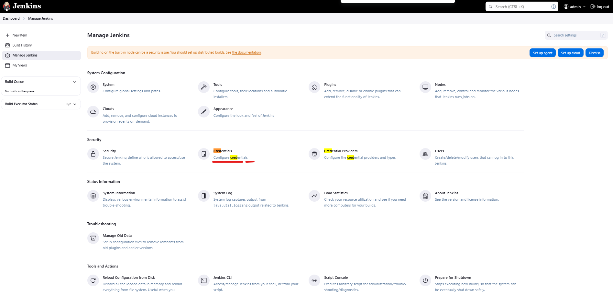

# Jenkins Git SSH Key Authentication

Document Version 1.0 
Date: 2025-01-06
Author:  [Talha Jilal] [ https://github.com/zaftechnologies ]
Copyright: 2025 Zaf Technologies Inc
Revision: 1.0

Copyright © 2025 Zaf Technologies Inc. All Rights Reserved.

 ## Table of Contents
- [Intro](#intro)
- [SSH Key Authentication](#jenkins-git-ssh-key-authentication)
- [Jenkins Sample Jobs](#jenkins-sample-job)


## Intro

In this section we learn how Jenkins can connect with github and pull code and run pipeline.

## SSH Key Authentication

1- Generate an SSH Key Pair:

On the Jenkins server, generate an SSH key:

```
ssh-keygen -t rsa -b 4096 -C "admin@localhost"

```


2- Save the private key on the Jenkins server.
```
cat /root/.ssh/id_rsa.pub
```
3- Copy the public key to GitHub:
4- Go to GitHub > Settings > Left Side Deploy Key -> and GPG keys.


5- Add the public key.


6- Store the Private Key in Jenkins:


7- Go to Manage Jenkins > Credentials > System > Global credentials.


8- Click Add Credentials.
9- Choose Kind: SSH Username with private key.
Username: git.
Private Key: Paste the private key.
Add an ID (e.g., github-ssh-key).


- Note : Run following command on Jenkins Node to add github.com as known host for ssh.

```
ssh-keyscan -t rsa github.com >> ~/.ssh/known_hosts
```

## Jenkins Sample Jobs

1- Jenkins Web Console  -> New Item

2- Provide pipeline name "FromGit" select pipeline and hit enter.


3- Next screen under pipeline section, select 
    -> Pipeline Script From SCM 
    -> Repository URL "git@github.com:zaftechnologies/git-practice.git"   ( We are going to use this repo for our test projects.)
    -> Credentials " In last section credentials created for github"
    -> branch "main" 


Now let's talk about git repo what and how we are going to store jenkinsfile on github.

```
git clone git@github.com:zaftechnologies/git-practice.git
cd git-practice
```

- Add Jenkinsfile in root directory 
- Add following content in Jenkinsfile.

```
node {
  stage ('Checkout') {
    echo "Hello"
    stage 'Build'
    sh 'echo test2'
    stage 'Test'
    sh 'echo test3'
  }
}
```

- commit code to repo

```
git add .
git commit -m "Jenkinsfile for first sample pipepline"
git push origin
```

- From Jenkins web console now trigger build for "FromGit" job.


