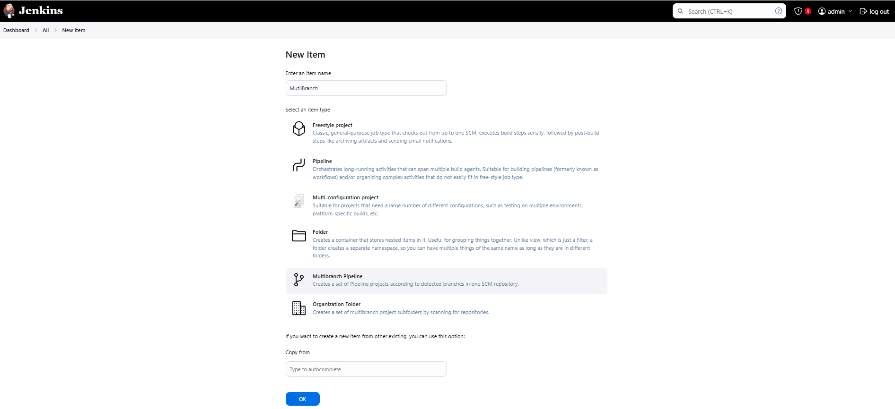
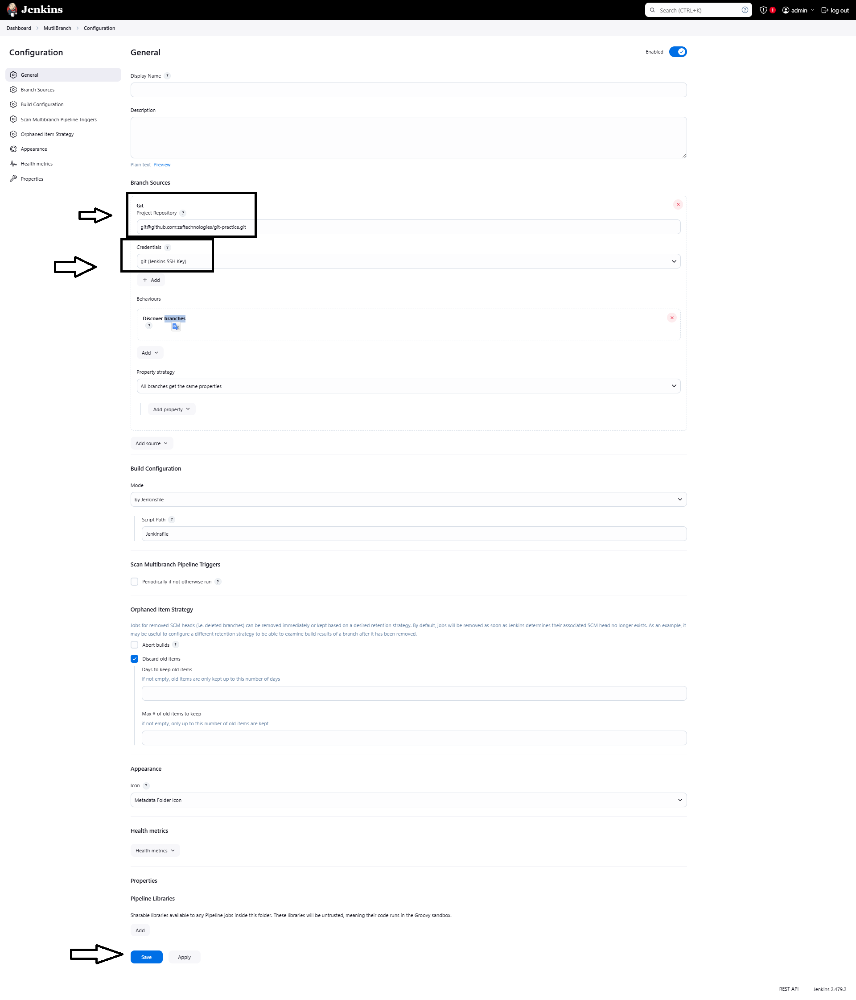
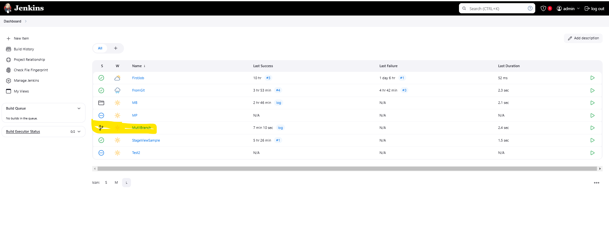
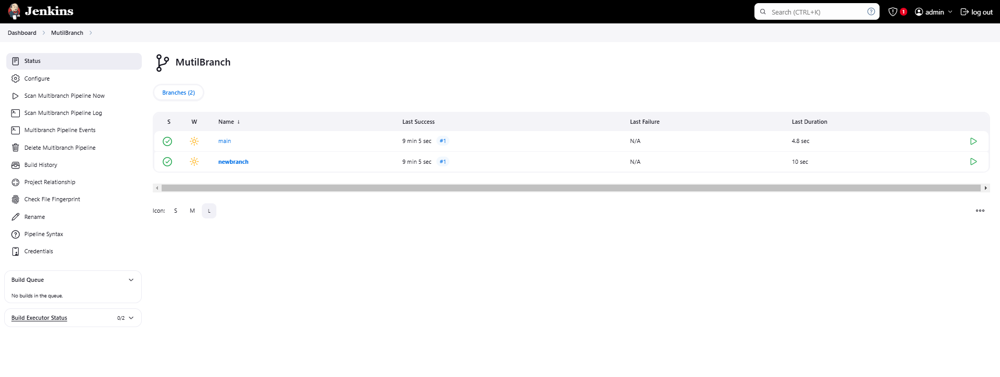
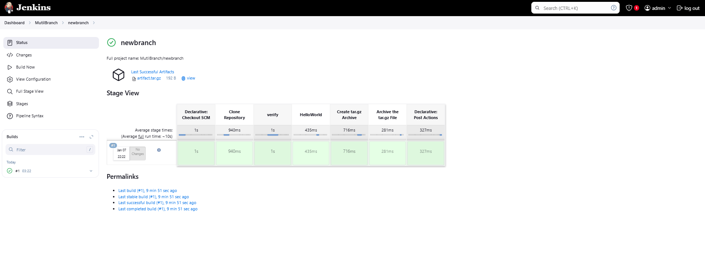

# Jenkins Pipeline As code.

Document Version 1.0 
Date: 2025-01-06
Author:  [Talha Jilal] [ https://github.com/zaftechnologies ]
Copyright: 2025 Zaf Technologies Inc
Revision: 1.0

Copyright © 2025 Zaf Technologies Inc. All Rights Reserved.

 ## Table of Contents
- [Intro](#intro)
- [Multibranch Pipeline](#multibranch-pipeline)
- [Create Multibranch pipeline](#create-multibranch-pipeline)
    - [Jenkinsfile](#jenkinsfile)


## Intro

In this section, we will explore how to use Jenkins Pipeline as Code and manage Jenkins build pipelines directly from GitHub using a Multibranch Pipeline.

## Multibranch Pipeline

- A Multibranch Pipeline allows Jenkins to automatically discover branches in your repository that contain a Jenkinsfile. Each branch will have its own pipeline, which is useful for working with feature branches, pull requests, or any other branch that requires its own build process. This approach makes it easy to control and manage different build pipelines for different branches, all from within GitHub.

## Create Multibranch pipeline

1- Jenkins web Console Cline "New Item" create a new pipeline 
2- Enter an item name "Multibranch" 
3- Select "Multibranch Pipeline"
4- Click OK 



5- In next section provide "Git URL" and "Credentials"  click Save 

We are using following git repo for tutorial and this git repo have two branches, 

git@github.com:zaftechnologies/git-practice.git

Branches : Main & newbranch

Git credentials we have already saved in jenkins

Each branch of this repo must have Jenkinsfile. ( Jenkinsfile syntax detail we discuss at the end of this demo. )



6- Multibranch scan the define repo and branches, it will create folder on jenkins main page with name mentioned at creation time.



7- After we click on multibranch folder, we can see two pipelines created. ( from each branch of provided git repo)



8- Click on branch and validate pipeline steps. 




### Jenkinsfile


In git-practice git repository we have two branches. 

1- main 
2- newbranch

Each branch have different version of Jenkinsfile. 

#### main branch jenkinsfile

Jenkinsfile in main branch is basic just for understanding of stages and steps. 

```
node {
  stage ('Checkout') {
    echo "Hello"
    stage 'Build'
    sh 'echo test2'
    stage 'Test'
    sh 'echo test3'
  }
}
```

----> node, It deal with jenkins executor, set the job execution direction on which jenkins node this job will run.
----> stage, Stages divide the pipeline into logical phases such as Build, Test, Deploy, etc., making it easier to maintain and debug.