# AWS Free Tier Account Linux VM

Document Version 1.0 
Date: 2021-06-01
Author:  [Talha Jilal] [ https://github.com/zaftechnologies ]
Copyright: 2024 Zaf Technologies Inc
Revision: 1.0

Copyright © 2024 Zaf Technologies Inc. All Rights Reserved.

## Table of Contents
- [AWS Free Tier Account Linux VM](#aws-free-tier-account-linux-vm)
  - [Table of Contents](#table-of-contents)
  - [Intro](#intro)
  - [AWS Free Tier Account](#aws-free-tier-account)
    - [Signup on AWS](#signup-on-aws)
    - [AWS CLI Installation Steps](#aws-cli-installation-steps)
    - [Terraform Installation](#terraform-installation)
  - [Create Free Tier Linux Instance (VM)](#create-free-tier-linux-instance-vm)
  - [SSHing To AWS Linux VM](#sshing-to-aws-linux-vm)

## Intro

Amazon Web Services (AWS) is a leading cloud computing platform offering a wide range of services for businesses and individuals alike. With AWS, users can easily deploy and manage virtual machines, storage, databases, and more, providing unparalleled flexibility and scalability for their computing needs. Harness the power of AWS to create virtual Linux instances, enabling hands-on practice and experimentation with various Linux distributions and configurations.

## AWS Free Tier Account

To create an AWS Free Tier account, simply visit the AWS website, follow the registration process, and provide your payment information. Enjoy access to a wide range of AWS services with generous usage limits and no initial cost, perfect for experimentation and learning in the cloud.

### Signup on AWS

1. Visit [AWS Free Tier](https://aws.amazon.com/free) and click on "Create account".
   
2. Verify your email address.
   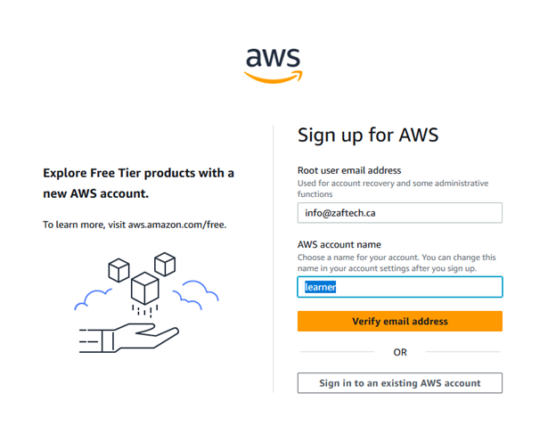
3. Provide credit card information for account verification.
   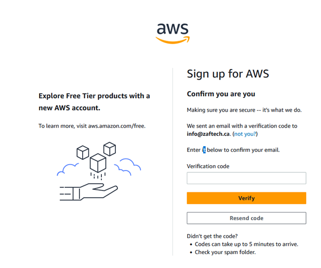
4. Login to your AWS account.
   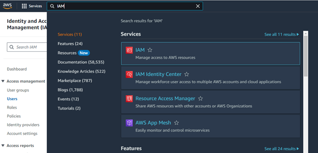
5. In the search bar, search for "IAM".
   
6. On the left side, click on "Users" and then click "Create User".
   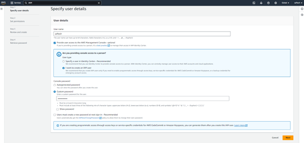

Note: In this tutorial, we will create a simple admin user. Later, we will discuss IAM roles and policies in detail.

7. Proceed with the following options:
   - Grant full admin access
   - Grant `PowerUserAccess` policy
   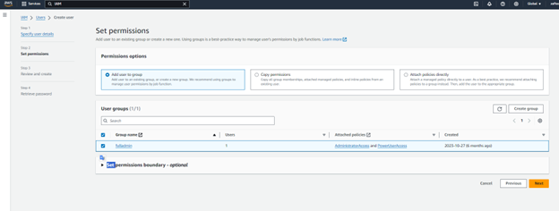

8. We will discuss tags later.

9. Now, let’s create user “zaftech” with programmatic access. 
   - From the left pane, click "Users" and select user "zaftech".
   - Click on your desired user, and on the right side, you will see "Create access key".
   

10. Select option 1 "Command Line Interface (CLI)".
11. Provide a meaningful description.
12. Download the key.
   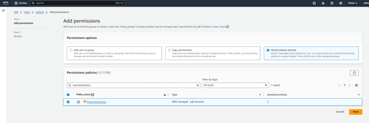

### AWS CLI Installation Steps

Follow the instructions for [AWS CLI installation](https://docs.aws.amazon.com/cli/latest/userguide/getting-started-install.html).

### Terraform Installation

Follow the instructions for [Terraform installation](https://developer.hashicorp.com/terraform/tutorials/aws-get-started/install-cli).

## Create Free Tier Linux Instance (VM)

Easily spin up Linux virtual machines on AWS Free Tier with just a few clicks, providing a cost-effective solution for learning, testing, and deploying applications in the cloud.

1. Type `ec2` in the search bar and create a new EC2 instance.
2. Click on "Launch Instance".
   ![Launch Instance]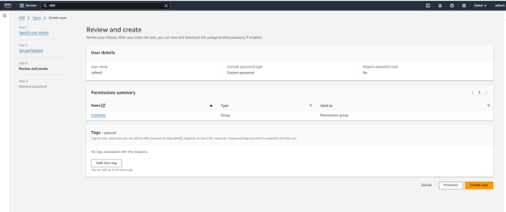
3. Configure the instance:
   - Name: "TestVM" or any meaningful name
   - AMI: Amazon Linux
   - Instance Type: Select "T2 Micro" (Free Tier)
   - Key Pair: Create a new key pair and store it on your local computer.
   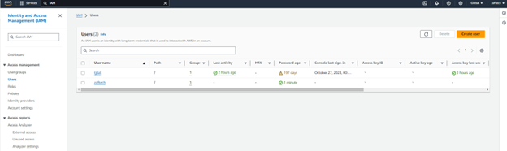

   Note: We are going to use [Putty](https://www.chiark.greenend.org.uk/~sgtatham/putty/latest.html). Download the key in Putty supported format.

4. Security group: Ensure SSH for incoming is enabled to access the VM from anywhere.
   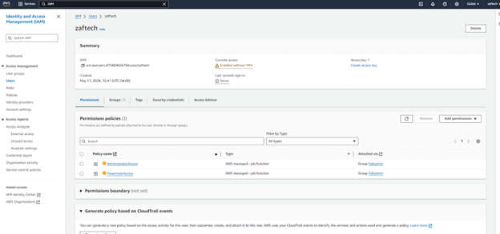
5. Click on "Network Settings" and enable Public IP (required to access the VM).
6. Click on "Launch instance". Your Linux VM will be initialized in a few minutes.
   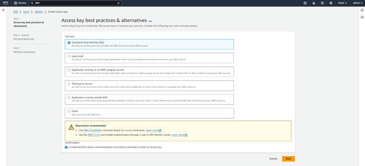

## SSHing To AWS Linux VM

1. Search for `EC2` in the search bar and click on "Instances (running)".
2. Select your instance. In "Networking Properties", you can find the Public IP address.
   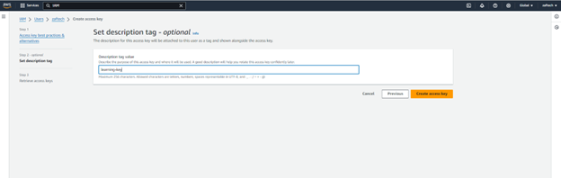
3. Download Putty from [here](https://the.earth.li/~sgtatham/putty/latest/w64/putty.exe).
4. Run the `putty.exe` executable file on your Windows VM.
5. Connect to your instance:
   - `ec2-user@<ipaddress-from-aws-console>`
   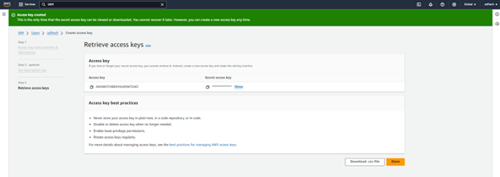
6. In Putty, navigate to `Connections -> Auth -> Credentials` and browse to the path of your private key (e.g., `C:/ssh/keyname.ppk`).
   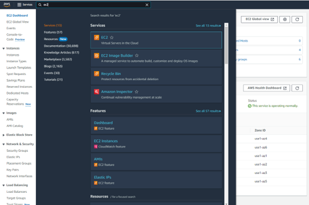

Enjoy using your AWS Free Tier Linux VM!
